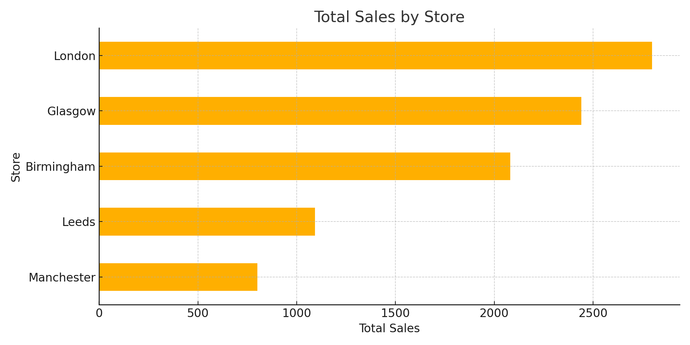

# 🧠 Retail Sales Forecasting – InsightCraft Engineering

This project simulates a real-world retail analytics task — forecasting UK retail sales across multiple cities and products. It was developed by **Michael Osazuwa** as part of the InsightCraft Engineering portfolio.

---

## 📁 Project Structure

- `data/`
  - `raw_sales.csv` – original dataset
  - `cleaned_sales.csv` – cleaned dataset for analysis

- `notebooks/`
  - `eda.ipynb` – exploratory analysis & visualizations

- `visuals/`
  - `sales_by_store.png` – store-level sales chart

---

## 🔍 Key Objectives

- Understand store and product performance
- Identify monthly trends and total revenue
- Use visual insights to guide retail strategy

---

## 📈 Visual Preview

---

## 🔧 Tools Used

- Python (Pandas, Matplotlib, Seaborn)
- Jupyter Notebook
- GitHub

---

## 📬 Author

Michael Osazuwa  
📧 michael.osazuwa@insightcraft.co.uk *(custom domain coming soon)*  
🔗 [GitHub Profile](https://github.com/MichaelOsazuwa)
